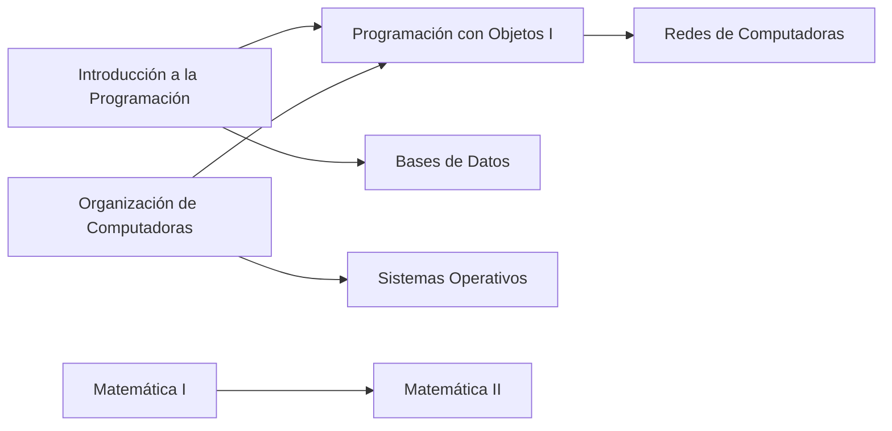

# Documentación de Requerimientos de Negocio (BRD)

**Proyecto:** Grafo Interactivo de Correlatividades y Seguimiento de Progreso Académico

---

## Ficha técnica del documento

| Campo                 | Detalle                                                              |
| --------------------- | -------------------------------------------------------------------- |
| Institución           | Universidad Nacional de Hurlingham (UNAHUR)                          |
| Unidad Académica      | Facultad de Informática — Proyecto Integrador Programación           |
| Tipo de documento     | BRD — Documentación de Requerimientos de Negocio                     |
| Versión               | 1.0                                                                   |
| Fecha                 | 10 de septiembre de 2026                                              |
| Sponsor Operación     | Secretaría Académica / Dirección de Carrera                          |
| Sponsor Organización  | UNAHUR                                                               |
| Integrantes           | Perugini, Pablo; Acuña, Marcos; Masgo Sandoval, Joaquín; Renaud, Román; Remonda, Eliel; Cotera, Dylan |
| Release               | Diciembre 2026                                                       |

---

## Tabla de contenidos

1. [Historial de Cambios](#1-historial-de-cambios)
2. [Alcance](#2-alcance)
3. [Requerimientos de Negocio](#3-requerimientos-de-negocio)
4. [Requerimientos Funcionales](#4-requerimientos-funcionales)
5. [Pantallas de Usuario](#5-pantallas-de-usuario)
6. [Glosario](#6-glosario)
7. [Minutas de Reunión](#7-minutas-de-reunión)

---

## 1. Historial de Cambios

| Versión | Fecha        | Autor | Descripción      |
| ------- | ------------ | ----- | ---------------- |
| 1.0     | 10/09/2026   | Equipo | Versión inicial. |

---

## 2. Alcance

### 2.1 Descripción del Proyecto / Objetivos

Desarrollar una aplicación web interactiva que represente el plan de estudios de una carrera universitaria como un **grafo dirigido**. La plataforma permitirá que:

- Los **estudiantes** inicien sesión (nickName + contraseña), visualicen el estado de sus materias (*Aprobada, Regular, Cursando, Pendiente*) y actualicen su progreso de manera interactiva sobre los nodos.
- El **sistema** evalúe las correlatividades y desbloquee/bloquee automáticamente las materias sucesivas según el historial del alumno.
- El **administrador** (Dirección de Carrera) cargue una carrera, importe el plan oficial en PDF, edite correlatividades y publique el plan.

Ejemplo conceptual de las correlatividades que la aplicación debe representar:

### 2.2 Justificación

Los planes de estudio universitarios suelen ser complejos y estar llenos de dependencias cruzadas (correlativas para cursar o rendir). Los alumnos a menudo se confunden sobre qué materias pueden cursar según su historia académica. Una interfaz gráfica interactiva previene errores de inscripción y acelera la planificación de la carrera.

### 2.3 Hipótesis

- **H1:** Una visualización gráfica e intuitiva reduce la incertidumbre del estudiante al armar su cursada cuatrimestral.
- **H2:** El almacenamiento del progreso mediante autenticación de usuarios garantiza la persistencia de datos entre sesiones, sin depender de sistemas externos o planillas manuales.

### 2.4 Restricciones

- La ingesta se basa en la estructura del PDF exportado por **SIU-Guaraní** (tolera campos vacíos como créditos/puntaje).
- La aplicación **NO reemplaza** la transacción de inscripción oficial (se efectúa en SIU-Guaraní); solo asiste la planificación.
- Compatibilidad garantizada con navegadores web modernos (Chrome, Edge, Firefox).
- Los planes soportados siguen el modelo año/cuatrimestre con créditos numéricos (entero o vacío).

> [!IMPORTANT]
> La aplicación es una herramienta de **planificación y asistencia**. La inscripción formal a materias siempre se realiza en **SIU-Guaraní**.

### 2.5 Supuestos

- El formato del PDF "Plan de Estudios" de SIU-Guaraní se mantiene estable durante el ciclo lectivo.
- Existen usuarios creados con anterioridad que ya poseen un grafo cargado.
- Los planes de las carreras soportadas siguen el modelo año/cuatrimestre con créditos numéricos (entero o vacío).

### 2.6 Dependencias

- Disponibilidad del reporte "Plan de Estudios" en PDF generado por el usuario.
- Servidor de base de datos (MongoDB) y caché (Redis) disponibles.
- Acceso al entorno de ejecución para deploy local/Docker.

### 2.7 Actores / Stakeholders

| Actor                        | Rol                                                                  |
| ---------------------------- | -------------------------------------------------------------------- |
| Estudiante                   | Consulta y actualiza su propio progreso sobre el grafo.              |
| Administrador / Dirección de Carrera | Carga y publica planes, edita correlatividades.              |
| Docentes                     | Consulta opcional (solo lectura), si lo requiere la secretaría.      |

### 2.8 Alcance del Proyecto

El alcance incluye:

- Módulo de autenticación (registro, login).
- Visualizador gráfico del plan de estudios en forma de nodos interactivos (grafo).
- Lógica backend de validación de correlatividades.
- Motor de sugerencias de inscripción basado en reglas de negocio.
- Panel de estadísticas básicas del progreso del estudiante (porcentaje de carrera avanzada).

---

## 3. Requerimientos de Negocio

### 3.1 Reglas de Negocio

#### 3.1.1 Reglas del grafo y progreso académico

| ID   | Regla                    | Condición                                                                                 | Acción / Descripción                                                                                                       |
| ---- | ------------------------ | ----------------------------------------------------------------------------------------- | --------------------------------------------------------------------------------------------------------------------------- |
| RN01 | Estado inicial del nodo  | Los requisitos previos de la materia no están cumplidos en el historial del estudiante.    | La materia se muestra **bloqueada** (color gris, inhabilitada).                                                            |
| RN02 | Habilitación por correlativas | El estudiante marca una materia como *Aprobada* o *Regular* (según exija el plan).      | El sistema evalúa el grafo y habilita las materias sucesivas (disponibles, clickeables).                                   |
| RN03 | Persistencia de progreso | El usuario modifica el estado de un nodo.                                                 | El cambio se guarda asociado a su cuenta de usuario en la base de datos (tiempo real o guardado explícito).                |
| RN04 | Restricción de desmarcado | El usuario desmarca una materia como aprobada.                                           | El sistema revierte el estado de las materias dependientes subsiguientes que quedaron sin sustento correlativo.            |

#### 3.1.2 Reglas de sugerencia de inscripción

| ID | Regla                 | Condición                                                                                                   | Acción                                                                       | Ref. |
| -- | --------------------- | ----------------------------------------------------------------------------------------------------------- | ---------------------------------------------------------------------------- | ---- |
| R0 | Encabezado            | Siempre.                                                                                                    | Enviar mensaje de encabezado al alumno.                                      | Msj0 |
| R1 | Correlativas          | El alumno regularizó ciertas materias.                                                                      | Sugerirle que curse las siguientes en orden de correlatividad.               | Msj1 |
| R2 | Regularizadas         | Se anotó en los últimos dos cuatrimestres en (y) materias y regularizó (x) materias.                        | Sugerirle que curse solo **(x + 1)** materias.                               | Msj2 |
| R3 | Materias comunes      | El alumno no cursó *Nuevos Entornos*, *Niveles de Inglés* o *Materias UNAHUR*.                              | Sugerirle que curse las materias comunes que no cursó.                       | Msj3 |
| R4 | Finales               | El alumno adeuda finales.                                                                                   | Sugerirle que rinda los finales pendientes.                                  | Msj4 |
| R5 | Orientación           | Inscripto hace más de 2 años y (< 3 materias regularizadas, no aprobó el 1er año o adeuda más de 4 finales). | Sugerirle que se dirija a la Dirección de Orientación y Acompañamiento.      | Msj5 |
| R6 | Cierre                | Siempre.                                                                                                    | Enviar mensaje de cierre al alumno.                                          | Msj6 |

> La implementación funcional de estas reglas (tabla de decisión completa y textos de los mensajes) se documenta en el **FRD, Sección 3**.

### 3.2 Casos de Estudio

#### CS-01 · Estudiante de ingreso reciente

- **Condiciones:** Solo tiene disponibles las materias de primer año sin correlativas previas. El resto del grafo permanece bloqueado.
- **Acciones esperadas:** Al aprobar *Introducción a la Programación*, se habilitan automáticamente *Programación con Objetos I* y *Organización de Computadoras*.

#### CS-02 · Estudiante con recorrido avanzado

- **Condiciones:** Carga un historial con varias materias aprobadas.
- **Acciones esperadas:** El grafo refleja de inmediato un camino crítico abierto hacia materias de años superiores (ej. 3er año), permitiéndole visualizar qué le falta cursar para recibirse.

#### CS-03 · Alumno 1 (sugerencias)

- **Condiciones:** Regularizó ciertas materias, se inscribe en pocas, no cursó materias comunes, está inscripto hace más de 2 años sin aprobar todo el primer año.
- **Acciones:** sugerir correlativas, limitar la inscripción, recomendar materias comunes y derivar a orientación.

#### CS-04 · Alumno 2 (sugerencias)

- **Condiciones:** Regularizó algunas materias, adeuda finales y no cursó materias comunes.
- **Acciones:** sugerir correlativas, recomendar materias comunes y recomendar rendir finales.

#### CS-05 · Alumno 3 (sugerencias)

- **Condiciones:** Regularizó algunas materias y está inscripto hace más de 2 años con pocas regularizadas.
- **Acciones:** sugerir correlativas, limitar la inscripción y derivar a orientación.

---

## 4. Requerimientos Funcionales

El detalle funcional completo (User Stories, criterios de bondad, reglas de negocio implementadas) se encuentra en el documento complementario **FRD — Documentación de Requerimientos Funcionales**.

Resumen de la épica principal:

| Épica | Descripción                                                                                       | Estimación |
| ----- | ------------------------------------------------------------------------------------------------- | ---------- |
| EP-1  | Aplicación de correlatividades y progreso académico: grafo dirigido, actualización de progreso y gestión de planes. | 4 meses    |

---

## 5. Pantallas de Usuario

Vista de alto nivel. El detalle por pantalla se encuentra en el **FRD, Sección 5**.

| Pantalla   | Descripción                                                                     |
| ---------- | ------------------------------------------------------------------------------- |
| SC001      | Inicio de sesión y registro.                                                     |
| SC002      | Panel del estudiante: grafo interactivo con estados y sugerencias.              |
| SC003      | Panel del administrador: importación de PDF, edición y publicación del plan.    |
| SC004      | Estadísticas de progreso académico.                                              |
| SC005      | Pantalla de orientación.                                                         |

---

## 6. Glosario

| Término                 | Descripción                                                                                          |
| ----------------------- | ---------------------------------------------------------------------------------------------------- |
| Grafo                   | Estructura de datos compuesta por vértices (nodos/materias) y aristas dirigidas que representan relaciones de correlatividad. |
| Correlativa             | Materia previa requerida obligatoriamente para poder cursar o rendir otra posterior.                   |
| Nodo bloqueado          | Materia que aún no puede cursarse por falta de requisitos previos en el historial académico.           |
| Materia disponible      | Materia que cumple todas las condiciones correlativas necesarias en el estado actual del alumno.       |
| Camino crítico          | Secuencia de materias cuya aprobación destraba la mayor cantidad de correlativas sucesivas hacia la titulación. |
| Historia de usuario     | Descripción corta y concisa desde el punto de vista del usuario final para definir una funcionalidad.  |
| Criterio de aceptación  | Condiciones que la funcionalidad debe cumplir para darse por completada y aprobada.                    |
| SIU-Guaraní             | Sistema informático utilizado por la universidad para la gestión de expedientes académicos y actas. La app importa su reporte "Plan de Estudios". |

---

## 7. Minutas de Reunión

| Fecha            | Tema                                             | Acuerdos / Pendientes                                      |
| ---------------- | ------------------------------------------------ | ---------------------------------------------------------- |
| 10/09/2026       | Reunión inicial del equipo: definición del alcance de la app. | Se definió el alcance del proyecto y los requerimientos iniciales. |