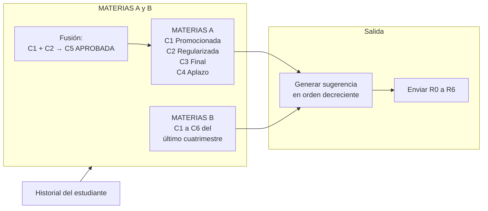

# Documentación de Requerimientos Funcionales (FRD)

**Proyecto:** Grafo Interactivo de Correlatividades y Seguimiento de Progreso Académico

---

## Ficha técnica del documento

| Campo                 | Detalle                                                              |
| --------------------- | -------------------------------------------------------------------- |
| Institución           | Universidad Nacional de Hurlingham (UNAHUR)                          |
| Unidad Académica      | Facultad de Informática — Proyecto Integrador Programación           |
| Tipo de documento     | FRD — Documentación de Requerimientos Funcionales                    |
| Versión               | 2.0                                                                   |
| Fecha                 | 24 de septiembre de 2026                                              |
| Sponsor Operación     | Secretaría Académica / Dirección de Carrera                          |
| Sponsor Organización  | UNAHUR                                                               |
| Integrantes           | Perugini, Pablo; Acuña, Marcos; Masgo Sandoval, Joaquín; Renaud, Román; Remonda, Eliel; Cotera, Dylan |
| Release               | Diciembre 2026                                                       |

---

## Tabla de contenidos

1. [Historial de Cambios](#1-historial-de-cambios)
2. [Alcance](#2-alcance)
3. [Información de Requerimientos de Negocio](#3-información-de-requerimientos-de-negocio)
4. [Requerimientos Funcionales](#4-requerimientos-funcionales)
5. [Pantallas de Usuario](#5-pantallas-de-usuario)
6. [Glosario](#6-glosario)
7. [Minutas de Reunión](#7-minutas-de-reunión)

---

## 1. Historial de Cambios

| Versión | Fecha        | Autor | Descripción      |
| ------- | ------------ | ----- | ---------------- |
| 1.0     | 10/09/2026   | Equipo | Versión inicial. |
| 2.0     | 24/09/2026   | Equipo | Revisión mayor alineada con la implementación actual. Se retiran los requerimientos que **no corresponden** a la aplicación (historial 1.1–1.9): autenticación por cookie y usuarios, roles, recuperación de contraseña, chat del orientador con IA, matching semántico por embeddings, selector de carrera `?degree=`, compartir/exportar imagen y suites de tests con CI. Se documentan las pantallas reales, la identificación anónima por `x-user-id`, el título intermedio y el manejo centralizado de errores. |

---

## 2. Alcance

### 2.1 Descripción del Proyecto / Objetivos

Desarrollar una aplicación web interactiva que represente el plan de estudios de una carrera universitaria como un **grafo dirigido**. La plataforma permitirá que:

- Los **estudiantes** visualicen el estado de sus materias (*Aprobada, Regular, Cursando, Pendiente*) y actualicen su progreso de manera interactiva sobre los nodos, sin necesidad de crear una cuenta (el progreso se asocia al identificador local del navegador, `x-user-id`).
- El **sistema** evalúe las correlatividades y desbloquee/bloquee automáticamente las materias sucesivas según el historial del alumno.
- El **administrador** (Dirección de Carrera) cargue una carrera, importe el plan oficial en PDF, edite correlatividades y publique el plan.

### 2.2 Justificación

Los planes de estudio universitarios suelen ser complejos y estar llenos de dependencias cruzadas (correlativas para cursar o rendir). Los alumnos a menudo se confunden sobre qué materias pueden cursar según su historia académica. Una interfaz gráfica interactiva previene errores de inscripción y acelera la planificación de la carrera.

### 2.3 Hipótesis

- **H1:** Una visualización gráfica e intuitiva reduce la incertidumbre del estudiante al armar su cursada cuatrimestral.
- **H2:** El almacenamiento del progreso asociado a un identificador local por navegador garantiza la persistencia de datos entre sesiones, sin depender de sistemas externos o planillas manuales.

### 2.4 Restricciones

- La ingesta se basa en la estructura del PDF exportado por **SIU-Guaraní** (tolera campos vacíos como créditos/puntaje).
- El lector de PDF descarta las filas de totales y los títulos de sección (no se importan como materias) y detecta la tabla del **título intermedio** cuando el plan la incluye.
- La aplicación **NO reemplaza** la transacción de inscripción oficial (se efectúa en SIU-Guaraní); solo asiste la planificación.
- Compatibilidad garantizada con navegadores web modernos (Chrome, Edge, Firefox).
- Los planes soportados siguen el modelo año/cuatrimestre con créditos numéricos (entero o vacío).

> [!IMPORTANT]
> La aplicación es una herramienta de **planificación y asistencia**. La inscripción formal a materias siempre se realiza en **SIU-Guaraní**.

### 2.5 Supuestos

- El formato del PDF "Plan de Estudios" de SIU-Guaraní se mantiene estable durante el ciclo lectivo.
- El progreso se guarda por identificador local de navegador (`x-user-id`), generado la primera vez que se usa la app.
- Los planes de las carreras soportadas siguen el modelo año/cuatrimestre con créditos numéricos (entero o vacío).

### 2.6 Dependencias

- Disponibilidad del reporte "Plan de Estudios" en PDF generado por el usuario.
- Servidor de base de datos (MongoDB) y caché (Redis) disponibles; Redis es **best-effort** y la API funciona igual sin él.
- Acceso al entorno de ejecución para deploy local.

### 2.7 Actores / Stakeholders

| Actor                        | Rol                                                                  |
| ---------------------------- | -------------------------------------------------------------------- |
| Estudiante                   | Consulta y actualiza su propio progreso sobre el grafo.              |
| Administrador / Dirección de Carrera | Carga y publica planes, edita correlatividades.              |
| Docentes                     | Consulta opcional (solo lectura), si lo requiere la secretaría.      |

> [!NOTE]
> La implementación actual **no tiene cuentas ni roles**: cualquier visitante puede cargar y editar planes, y el progreso se separa por el identificador local del navegador (`x-user-id`). La tabla anterior refleja el modelo de negocio objetivo.

### 2.8 Alcance del Proyecto

El alcance incluye:

- Visualizador gráfico del plan de estudios en forma de nodos interactivos (grafo) y en vista de tablero.
- Lógica backend de validación de correlatividades (matching clásico: exacto, compacto, difuso y por prefijo), con camino crítico, orden topológico y detección de ciclos.
- Seguimiento del progreso por materia y por carrera, identificado por navegador (`x-user-id`).
- Carga de planes y de historiales académicos desde PDF, con edición de materias, correlatividades y publicación del plan.
- Soporte del **título intermedio**: detección en el PDF, créditos y materias del subconjunto, y banner de progreso en el grafo.
- Motor de sugerencias de inscripción basado en reglas de negocio (**pendiente de implementación**).
- Panel de estadísticas básicas del progreso del estudiante (porcentaje de carrera avanzada).
- Manejo centralizado de errores en la API y en la interfaz.

---

## 3. Información de Requerimientos de Negocio

### 3.1 Reglas de Negocio

#### 3.1.1 Reglas del grafo y progreso académico

| ID   | Regla                    | Condición                                                                                 | Acción / Descripción                                                                                                       |
| ---- | ------------------------ | ----------------------------------------------------------------------------------------- | --------------------------------------------------------------------------------------------------------------------------- |
| RN01 | Estado inicial del nodo  | Los requisitos previos de la materia no están cumplidos en el historial del estudiante.    | La materia se muestra **bloqueada** (color gris, inhabilitada).                                                            |
| RN02 | Habilitación por correlativas | El estudiante marca una materia como *Aprobada* o *Regular* (según exija el plan).      | El sistema evalúa el grafo y habilita las materias sucesivas (disponibles, clickeables).                                   |
| RN03 | Persistencia de progreso | El usuario modifica el estado de un nodo.                                                 | El cambio se guarda asociado a su cuenta de usuario en la base de datos (tiempo real o guardado explícito).                |
| RN04 | Restricción de desmarcado | El usuario desmarca una materia como aprobada.                                           | El sistema revierte el estado de las materias dependientes subsiguientes que quedaron sin sustento correlativo.            |

#### 3.1.2 Reglas de sugerencia de inscripción

> [!WARNING]
> **Estado:** requerimiento del proyecto **pendiente de implementación**. La aplicación actual no genera sugerencias de inscripción; las reglas se documentan porque definen el alcance funcional acordado.

Para cada cuatrimestre se generan reglas de la forma **MATERIAS A ⇒ MATERIAS B**, calculadas sobre el historial del estudiante.

**MATERIAS A** — materias del historial de un estudiante que cumplen estas condiciones al **inicio de un cuatrimestre**:

| Regla     | Condición                                             | Acción                                    |
| --------- | ----------------------------------------------------- | ----------------------------------------- |
| C1        | Aprobada con nota mayor o igual a 7.                  | Incluir tupla (ID_MATERIA, C1) en A.      |
| C2        | Aprobada con nota mayor o igual a 4 y menor a 7.      | Incluir tupla (ID_MATERIA, C2) en A.      |
| C3        | Aprobada, pero adeuda final.                          | Incluir tupla (ID_MATERIA, C3) en A.      |
| C4        | La cursó, pero la abandonó o no la aprobó.            | Incluir tupla (ID_MATERIA, C4) en A.      |

**MATERIAS B** — materias del estudiante que cumplen estas condiciones en el **último cuatrimestre** (según cómo le fue):

| Regla     | Condición                                             | Acción                                    |
| --------- | ----------------------------------------------------- | ----------------------------------------- |
| C1        | Promocionada (nota mayor o igual a 7).                | Incluir tupla (ID_MATERIA, C1) en B.      |
| C2        | Regularizada (nota mayor o igual a 4 y menor a 7).    | Incluir tupla (ID_MATERIA, C2) en B.      |
| C3        | Aprobada, pero adeuda final.                          | Incluir tupla (ID_MATERIA, C3) en B.      |
| C4        | La cursó, pero no la aprobó.                          | Incluir tupla (ID_MATERIA, C4) en B.      |
| C5        | La cursó, pero la abandonó.                           | Incluir tupla (ID_MATERIA, C5) en B.      |
| C6        | Se inscribió, pero no asistió a clase (ausente).      | Incluir tupla (ID_MATERIA, C6) en B.      |

**Reglas de cómputo de la sugerencia:**

- Dado un estudiante y un inicio de cuatrimestre, calcular su respectivo conjunto **MATERIAS A** y armar la sugerencia.
- Calcular las estadísticas de las **MATERIAS B** y mostrarlas en orden **decreciente**.
- Si para un estudiante **no** hay materias que cumplan **C4** en MATERIAS A, considerar solamente las primeras tres condiciones **C1, C2, C3**.
- Si para un estudiante **no** hay materias que cumplan **C1 y C2** en MATERIAS A, fusionar las dos primeras condiciones en **C5 [APROBADA]**: *la cursó y aprobó con nota mayor o igual a 4* — incluir la tupla (ID_MATERIA, C5) en MATERIAS A.

#### 3.1.3 Reglas de comunicación (mensajes)

| Regla | Condición                                                                                                | Acción / Mensaje                                    |
| ----- | -------------------------------------------------------------------------------------------------------- | --------------------------------------------------- |
| R0    | Siempre.                                                                                                 | Msj0 — Encabezado estándar.                         |
| R1    | El alumno regularizó ciertas materias.                                                                   | Msj1 — Sugerir materias en orden de correlatividad. |
| R2    | Se anotó en los últimos dos cuatrimestres en (y) materias y regularizó (x) materias.                     | Msj2 — Sugerir inscribirse en (x + 1) materias.     |
| R3    | No cursó Nuevos Entornos, Niveles de Inglés o Materias UNAHUR.                                           | Msj3 — Sugerir materias comunes no cursadas.        |
| R4    | El alumno adeuda finales.                                                                                | Msj4 — Sugerir rendir finales pendientes.           |
| R5    | Está inscripto hace más de 2 años (4 cuatrimestres) y (tiene menos de 3 materias regularizadas, no aprobó todo el 1er año, o adeuda más de 4 finales). | Msj5 — Sugerir acudir a Orientación. |
| R6    | Siempre.                                                                                                 | Msj6 — Cierre estándar.                             |

**Textos de los mensajes:**

> [!TIP]
> Los mensajes se envían de forma encadenada en el orden R0 → R6 (encabezado → sugerencias → pie). El texto completo de cada uno está disponible en la sección plegable.

<b>Ver textos completos (Msj0 – Msj6)</b>

- **Msj0:** *Estimado/a estudiante, en función de tu recorrido académico, te enviamos las siguientes sugerencias de inscripción para el próximo período.*
- **Msj1:** *Por un lado, considerando las materias que regularizaste hasta ahora, te sugerimos que consideres para tu inscripción algunas de las siguientes materias, en función de las correlatividades de tu plan de estudios:* {Listar las materias correlativas a las regularizadas, indicando la carga horaria de cada una}
- **Msj2:** *Por otro lado, hemos notado que en tus últimos dos cuatrimestres te has inscripto a (y) materias y has regularizado (x) materia/s. Por lo tanto, para el próximo cuatrimestre te sugerimos que te inscribas en (x + 1) materias.*
- **Msj3:** *Recordá que también podés cursar las siguientes materias comunes en cualquier momento de la carrera y que, por su carga horaria semanal, pueden ser un buen complemento para materias con mayor carga teórica:* {Listar las materias comunes que no cursó}
- **Msj4:** *Asimismo, es importante que en la planificación de tu cursada consideres también la preparación de los exámenes finales de las siguientes materias:* {Listar las materias con final pendiente}
- **Msj5:** *Finalmente, nos parece fundamental sugerirte que te acerques a la Dirección de Orientación y Acompañamiento, donde podrán asesorarte y acompañarte en la planificación de tu trayectoria académica. Podés comunicarte con ellos en la siguiente dirección: orientacionestudiantil@unahur.edu.ar*
- **Msj6:** *La planificación del cuatrimestre es un acto fundamental para el sostenimiento de la cursada en la universidad. En la UNAHUR estamos para acompañarte.* (Cierre completo según plantilla institucional.)

### 3.2 Casos de Estudio

#### CS-01 · Estudiante de ingreso reciente

- **Condiciones:** Solo tiene disponibles las materias de primer año sin correlativas previas. El resto del grafo permanece bloqueado.
- **Acciones esperadas:** Al aprobar *Introducción a la Programación*, se habilitan automáticamente *Programación con Objetos I* y *Organización de Computadoras*.

#### CS-02 · Estudiante con recorrido avanzado

- **Condiciones:** Carga un historial con varias materias aprobadas.
- **Acciones esperadas:** El grafo refleja de inmediato un camino crítico abierto hacia materias de años superiores (ej. 3er año), permitiéndole visualizar qué le falta cursar para recibirse.

#### CS-03 · Alumno 1 — envío de sugerencias

| Regla                    | Condición                                           | Mensaje |
| ------------------------ | --------------------------------------------------- | ------- |
| R0 Encabezado            | Siempre.                                            | Msj0    |
| R1 Correlativas          | Regularizó Introducción a la Programación, Organización de Computadoras, Inglés I. | Msj1 |
| R2 Regularizadas         | Se anotó en 4 materias y regularizó 1.              | Msj2    |
| R3 Materias comunes      | No cursó Nuevos Entornos y Lenguajes ni Materias UNAHUR. | Msj3 |
| R5 Orientación           | Inscripto hace más de 4 cuatrimestres sin aprobar todo el 1er año. | Msj5 |
| R6 Cierre                | Siempre.                                            | Msj6    |

**Mensajes enviados:** Msj0, Msj1, Msj2, Msj3, Msj5, Msj6.

#### CS-04 · Alumno 2 — envío de sugerencias

| Regla                    | Condición                                           | Mensaje |
| ------------------------ | --------------------------------------------------- | ------- |
| R0 Encabezado            | Siempre.                                            | Msj0    |
| R1 Correlativas          | Regularizó Introducción a la Programación y Organización de Computadoras. | Msj1 |
| R3 Materias comunes      | No cursó Nuevos Entornos y Lenguajes, Materias UNAHUR, Inglés I. | Msj3 |
| R4 Finales               | Adeuda final de Matemática I.                       | Msj4    |
| R6 Cierre                | Siempre.                                            | Msj6    |

**Mensajes enviados:** Msj0, Msj1, Msj3, Msj4, Msj6.

#### CS-05 · Alumno 3 — envío de sugerencias

| Regla                    | Condición                                           | Mensaje |
| ------------------------ | --------------------------------------------------- | ------- |
| R0 Encabezado            | Siempre.                                            | Msj0    |
| R1 Correlativas          | Regularizó Organización de Computadoras y Matemática I. | Msj1 |
| R2 Regularizadas         | Se anotó en 4 materias y regularizó 2.              | Msj2    |
| R5 Orientación           | Inscripto hace más de 4 cuatrimestres con menos de 3 materias regularizadas por año. | Msj5 |
| R6 Cierre                | Siempre.                                            | Msj6    |

**Mensajes enviados:** Msj0, Msj1, Msj2, Msj5, Msj6.

---

## 4. Requerimientos Funcionales

### 4.1 User Stories

#### Épica EP-1 · Aplicación de correlatividades y progreso académico

| Campo          | Valor                                                            |
| -------------- | ---------------------------------------------------------------- |
| Proyecto       | Grafo Interactivo de Correlatividades                            |
| Status         | Draft                                                            |
| Responsable    | Dirección de Carrera UNAHUR                                      |
| Creado         | Septiembre 2026                                                  |
| Última actualización | Septiembre 2026                                            |
| Descripción    | Aplicación web que representa el plan de estudios como grafo dirigido, permitiendo a estudiantes visualizar y actualizar su progreso académico y a administradores cargar planes oficiales y editar correlatividades. |
| Estimación     | 4 meses                                                          |

#### Historias de usuario

| ID    | Como          | Quiero                                                                                                            | Para                                                                                    | Criterio de Aceptación                                                                                      | Dependencia |
| ----- | ------------- | ----------------------------------------------------------------------------------------------------------------- | --------------------------------------------------------------------------------------- | ----------------------------------------------------------------------------------------------------------- | ----------- |
| AR-1  | Estudiante    | Visualizar mi progreso académico en un grafo interactivo.                                                         | Planificar mi cursada.                                                                   | El sistema muestra materias aprobadas, regularizadas, cursando y pendientes con colores/nodos diferenciados. | —           |
| AR-2  | Administrador | Importar el plan de estudios en PDF y editar correlatividades.                                                    | Publicar la carrera.                                                                     | El sistema permite cargar PDF del plan y modificar relaciones entre materias.                               | —           |
| AR-3  | Estudiante    | Recibir sugerencias automáticas de inscripción dentro de la plataforma.                                           | Decidir mi inscripción según mi recorrido académico.                                    | **Pendiente:** el sistema aplicará las reglas de negocio (R0–R6, ver §3.1.2) y mostrará las recomendaciones en pantalla. | —           |
| US-02 | Estudiante    | Visualizar el plan de estudios en forma de grafo interactivo.                                                     | Identificar rápidamente qué materias puedo cursar, cuáles tengo aprobadas y cuáles están bloqueadas. | Diferenciar claramente por colores según su estado (aprobada, disponible, bloqueada). **Título intermedio:** si la carrera lo otorga, un banner sobre el grafo muestra materias y créditos aprobados sobre el total del título intermedio. | —           |
| US-03 | Estudiante    | Hacer clic en una materia disponible para cambiar su estado.                                                       | Ver cómo se actualizan dinámicamente las materias subsiguientes en el grafo.             | Clickear en un nodo habilitado lo cambia de color e inmediatamente desbloquea los nodos hijos en pantalla.  | —           |

### 4.2 Criterios de Bondad

- **MATERIAS BLOQUEADAS:** Materias del plan cuyos requisitos previos o correlatividades no están cumplidos en el historial del estudiante; permanecen inhabilitadas para cursar.
- **MATERIAS DISPONIBLES:** Materias que cumplen todas las condiciones correlativas necesarias en el estado actual del alumno; quedan habilitadas para su selección e inscripción en el grafo.
- **GESTIÓN DE ESTADOS Y DINÁMICA DEL GRAFO:** Calcular y actualizar en tiempo real el desbloqueo o bloqueo de materias sucesivas en función de los cambios de estado realizados por el usuario sobre los nodos.
- **MATERIAS A ⇒ MATERIAS B (pendiente de implementación):** Para cada cuatrimestre, generar la sugerencia conforme las reglas C1–C6 (ver Sección 3.1.2).
- **ORDEN DE ESTADÍSTICAS (pendiente de implementación):** Mostrar las estadísticas de MATERIAS B en orden **decreciente**.
- **FUSIÓN DE CONDICIONES (pendiente de implementación):** Si no hay materias C4 en MATERIAS A, usar solo C1, C2, C3. Si no hay materias C1/C2, fusionarlas en C5 [APROBADA] (nota ≥ 4).
- **CORRELATIVIDADES:** el matching entre el plan oficial y el PDF de correlativas es clásico (exacto, compacto, difuso/Levenshtein y por prefijo), con nivel de confianza devuelto en la respuesta (`exact` | `compact` | `fuzzy` | `null`).
- **TÍTULO INTERMEDIO:** si el PDF del plan declara un título intermedio, el backend expone sus créditos y materias (`creditsIntermediate`, `intermediateTitle`, `subject.intermediate`) y el grafo muestra el banner con el avance de ese título; en carreras sin título intermedio no se muestra.
- **MANEJO DE ERRORES:** toda falla se responde en JSON con un mensaje en español (`400` validaciones y IDs inválidos, `404` recurso inexistente, `409` duplicados, `500` genérico); la interfaz no se rompe y muestra el mensaje (`ErrorBoundary` + `api/client.ts`).

### 4.3 Requisitos de Seguridad

- **Sin autenticación:** la aplicación no tiene cuentas, sesiones ni tokens; no existen endpoints de usuarios ni diferencias de permisos entre visitantes.
- **Identificación del progreso:** el progreso se asocia al header `x-user-id`, que el frontend genera una sola vez y guarda en `localStorage`. `POST /progress` y `GET /progress/me` responden `401` si el header falta. Es una clave local por navegador, no un token de sesión.
- **Subida de archivos:** solo se aceptan archivos PDF (mimetype o extensión `.pdf`) de hasta **10 MB**, que se procesan en memoria y no se persisten en disco.
- **Errores:** todas las respuestas de error vienen en JSON con un mensaje en español (`400` para IDs inválidos y validaciones, `404` para recursos inexistentes, `409` para duplicados, `500` genérico); la interfaz las muestra sin romperse.
- **Sin datos personales:** al no gestionar cuentas, la API no expone usuarios ni credenciales.

---

## 5. Pantallas de Usuario

### SC001 · Inicio (`/`)

- **Campos:** ninguno (no hay login).
- **Comportamiento:** listado de carreras en tarjetas con su color e instituto, diferenciando las **publicadas** de los **borradores**, con accesos a *Cargar plan* y *Editar plan*. Si todavía no hay planes cargados, muestra un estado vacío con la acción para crear uno.

### SC002 · Grafo del plan (`/grafo/:id`)

- **Lienzo interactivo** (React Flow) con las materias organizadas por años/cuatrimestres y las correlativas como aristas dirigidas.
- Estados de cada materia: *Aprobada, Regular, Cursando, Pendiente* (colores diferenciados) y badge **"crítico"** en las materias del camino crítico.
- **Barra superior** con el progreso porcentual de la carrera y la leyenda del camino crítico.
- **Panel de detalles** de la materia seleccionada al hacer clic, con sus correlatividades y la posibilidad de cambiar su estado.
- **Banner de título intermedio** (solo si la carrera lo otorga): materias y créditos aprobados sobre el total del título intermedio, con barra de progreso.
- **Cambio de vista** a tablero desde la misma pantalla.

### SC003 · Tablero del plan (`/tablero/:id`)

- La misma información del grafo presentada en columnas por año/cuatrimestre, pensada para lectura lineal.

### SC004 · Mi progreso (`/progreso`)

- Resumen del avance por año y total de la carrera.
- **Importación del historial en PDF:** sube el PDF de la historia académica, muestra las materias detectadas y las aprobadas, y permite guardarlas de una vez ("Guardar en mi progreso").
- **Edición manual:** se cambia el estado (*Aprobada, Regular, Cursando, Pendiente*) y la nota de cada materia, con guardado masivo ("Guardar todo"), recalculando las correlatividades habilitadas.

### SC005 · Cargar plan (`/cargar`)

- **Zona de arrastre** para subir uno o varios PDF del plan oficial: a partir del nombre del archivo se crea la carrera, se parsea el PDF y se guardan sus materias (incluidos créditos y título intermedio cuando el plan los declara).
- **Lista de trabajos de importación** con su estado (*creando → parseando → guardando*) y mensaje de error si el PDF no tiene texto extraíble ("parece escaneado").
- Accesos directos a *ver grafo*, *ver tablero* y *editar* una vez terminada la importación, más la opción de publicar o eliminar el plan.

### SC006 · Admin del plan (`/admin/:id`)

- Tabla de carreras con su estado (**Publicada** / **Borrador**), selección de la carrera a editar y acceso al tablero.
- **Edición de materias:** tabla con datos, horas, créditos y badge **"Título intermedio"** cuando corresponde.
- **Editor de correlatividades:** se marcan los requisitos de cada materia y se muestran los cambios pendientes (contador de "cambios sin guardar") antes de guardar.
- **Publicación** del plan para que los estudiantes lo vean.

---

## 6. Glosario

| Término                 | Descripción                                                                                          |
| ----------------------- | ---------------------------------------------------------------------------------------------------- |
| Grafo                   | Estructura de datos compuesta por vértices (nodos/materias) y aristas dirigidas que representan relaciones de correlatividad. |
| Correlativa             | Materia previa requerida obligatoriamente para poder cursar o rendir otra posterior.                   |
| Nodo bloqueado          | Materia que aún no puede cursarse por falta de requisitos previos en el historial académico.           |
| Materia disponible      | Materia que cumple todas las condiciones correlativas necesarias en el estado actual del alumno.       |
| Camino crítico          | Secuencia de materias cuya aprobación destraba la mayor cantidad de correlativas sucesivas hacia la titulación. |
| MATERIAS A              | Conjunto de materias del historial del estudiante que cumplen las reglas C1–C4 al inicio de un cuatrimestre. |
| MATERIAS B              | Conjunto de materias del último cuatrimestre del estudiante que cumplen las reglas C1–C6.             |
| User Story              | Descripción corta y concisa desde el punto de vista del usuario final para definir una funcionalidad.  |
| Criterio de aceptación  | Condiciones que la funcionalidad debe cumplir para darse por completada y aprobada.                    |
| SIU-Guaraní             | Sistema informático utilizado por la universidad para la gestión de expedientes académicos y actas. La app importa su reporte "Plan de Estudios". |

---

## 7. Minutas de Reunión

| Fecha            | Tema                                             | Acuerdos / Pendientes                                      |
| ---------------- | ------------------------------------------------ | ---------------------------------------------------------- |
| 10/09/2026       | Reunión inicial del equipo: definición del alcance de la app. | Se definió el alcance del proyecto y los requerimientos iniciales. |