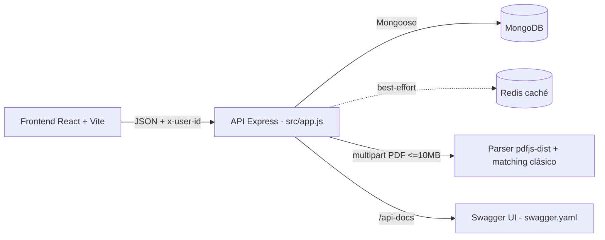

# Plan de Trabajo — API REST (Backend)

**Proyecto:** Gradify — Grafo Interactivo de Correlatividades y Seguimiento de Progreso Académico

---

## Ficha técnica del documento

| Campo | Detalle |
| ----- | ------- |
| Institución | Universidad Nacional de Hurlingham (UNAHUR) |
| Unidad Académica | Facultad de Informática — Proyecto Integrador Programación |
| Tipo de documento | Plan de Trabajo — API REST (Backend) |
| Versión | 1.1 |
| Fecha | 06 de octubre de 2026 |
| Sponsor Operación | Secretaría Académica / Dirección de Carrera |
| Sponsor Organización | UNAHUR |
| Integrantes | Perugini, Pablo; Acuña, Marcos; Masgo Sandoval, Joaquín; Renaud, Román; Remonda, Eliel; Cotera, Dylan |
| Documentos relacionados | `BRD.md` v2.2 · `FRD.md` v2.2 · `Test-Plan.md` · `Test-Cases.md` · `Matriz-Trazabilidad.md` · `backend/docs/swagger.yaml` |
| Release | Diciembre 2026 |

---

## Tabla de contenidos

1. [Historial de Cambios](#1-historial-de-cambios)
2. [Objetivo](#2-objetivo)
3. [Alcance de la API](#3-alcance-de-la-api)
4. [Contexto y arquitectura](#4-contexto-y-arquitectura)
5. [Inventario de endpoints](#5-inventario-de-endpoints)
6. [Modelo de datos (resumen)](#6-modelo-de-datos-resumen)
7. [Plan de trabajo por fases](#7-plan-de-trabajo-por-fases)
8. [Cronograma](#8-cronograma)
9. [Roles y responsabilidades](#9-roles-y-responsabilidades)
10. [Recursos y tecnologías](#10-recursos-y-tecnologías)
11. [Riesgos y mitigaciones](#11-riesgos-y-mitigaciones)
12. [Entregables y criterios de aceptación](#12-entregables-y-criterios-de-aceptación)
13. [Trazabilidad BRD / FRD ↔ API](#13-trazabilidad-brd--frd--api)
14. [Glosario](#14-glosario)

---

## 1. Historial de Cambios

| Versión | Fecha | Autor | Descripción |
| ------- | ----- | ----- | ----------- |
| 1.0 | 05/10/2026 | Equipo | Versión inicial. Inventario real desde `backend/src/routes/*.js` y `backend/docs/swagger.yaml`. |
| 1.1 | 06/10/2026 | Equipo | Corrección integral: contrato único de errores (envelope), contrato real de `POST /progress` (`{careerId, entries}`) y `GET /progress/me` (`{entries, summary}` + `?careerId`), `401 x-user-id` documentado en Swagger, decisión `/users` Opción A (legado congelado), fases 1–5 marcadas como ejecutadas y fase 6 como pendiente. |

---

## 2. Objetivo

Describir el plan de trabajo de la **API REST del backend** (Node.js + Express + MongoDB + Redis), que provee:

1. La **carga y parseo de planes de estudio** desde PDF oficial SIU-Guaraní (materias, créditos, título intermedio).
2. La **carga y matching de correlatividades** (exacto, compacto, difuso y por prefijo, con nivel de confianza).
3. El **grafo del plan** (nodos, aristas, orden topológico, camino crítico, detección de ciclos).
4. El **seguimiento del progreso** del estudiante por navegador (`x-user-id`), sin cuentas.
5. El **motor de sugerencias de inscripción** (reglas R0–R6 / C1–C6, FRD §3.1.2–3.1.3).

La API es consumida por el frontend (React + Vite) y está documentada en vivo en `GET /api-docs` (Swagger UI).

> **Estado a 06/10/2026:** las Fases 1–5 están **ejecutadas** (código + `npm test` + corridas 30/09 como evidencia). Solo la Fase 6 queda **pendiente** (registro formal caso por caso en Test-Cases y E2E UI 20–23). El cronograma (§8) lo refleja como H1–H5 ejecutados / H6 pendiente a diciembre 2026.

Fuera de alcance de la API (acuerdo de equipo, ver FRD §4.3): el módulo `/users` **se congela (Opción A)**: existe en código pero ninguna pantalla lo consume; no se amplía, no se expone en UI y solo `POST /users/register` y `POST /users/login` quedan documentados como legado. Las 4 rutas admin con JWT (`GET /users`, `GET/PATCH/DELETE /users/:nickName` en `src/routes/user.routes.js`) existen pero están fuera de alcance y no se documentan en Swagger.

---

## 3. Alcance de la API

### 3.1 Incluye

- CRUD de carreras (`draft` / `published`): crear, listar, actualizar, publicar, eliminar.
- Ingesta de PDF (máx. 10 MB, firma `%PDF-` verificada en servidor, en memoria, sin persistir en disco):
  - `parse-official`: plan oficial → materias.
  - `parse-correlativas`: tabla de correlativas → matching contra materias.
  - `parse-history`: historia académica del alumno → progreso detectable.
- Guardado de materias (`saveSubjects`) y de correlatividades (`saveCorrelativas` con whitelist + anti-ciclos, BUG-009).
- Grafo por carrera (`nodes`, `edges`, `stats`, `availableNow`, `criticalPath`, `topologicalOrder`, `intermediate`).
- Progreso por `x-user-id` (`POST /progress` con `{ careerId, entries: [{ subjectCode, status, nota?, fecha?, origen?, extraRequires? }] }` → `{ saved }`; `GET /progress/me?careerId=` → `{ entries, summary }`).
- Sugerencias AR-3 (`GET /careers/:id/sugerencias`: Materias A/B, disponibles, finales, comunes, mensajes Msj0–Msj6).
- Salud y raíz (`GET /health`, `GET /`).
- Manejo centralizado de errores en español con envelope único `{ success: false, error: { message, details? } }` (normalizado en `src/app.js`; `src/middlewares/errorHandler.js` traduce `400 / 401 / 404 / 409 / 500`) y códigos `400 / 401 / 404 / 409 / 500`.
- Documentación OpenAPI (`backend/docs/swagger.yaml`, 16 paths públicos) servida en `/api-docs`.

### 3.2 No incluye

- Transacción de inscripción oficial (se hace en SIU-Guaraní; la app solo asiste la planificación).
- Autenticación / sesiones / roles en uso (sin cuentas; `x-user-id` es clave local por navegador, no token).
- Persistencia de archivos PDF (se procesan en memoria).
- Chat orientador con IA, matching semántico por embeddings, orquestador multiproveedor (retirados del alcance en BRD v2.0; solo queda fallback IA puntual en parseo, con rate-limit propio).

---

## 4. Contexto y arquitectura



- **Punto de entrada:** `backend/src/main.js` (inicia server + DB + caché).
- **Configuración:** `backend/src/app.js` (CORS por whitelist, Helmet, JSON, envelope único de errores, `/api-docs`, 404, `errorHandler`).
- **Capas:** `routes/` → `controllers/` → `services/` + `models/` (Mongoose) + `middlewares/` (validación, `upload.js` con límite 10 MB + `isPdfBuffer` que verifica firma `%PDF-`, `withDeviceId` que exige `x-user-id` con `401`, `rateLimitAi`) + `config/` (mongo, redis) + `utils/` (`AppError`) + `schemas/` (Joi).
- **Contrato único de errores:** toda respuesta `>= 400` sale como `{ success: false, error: { message, details? } }` conservando campos propios (`dropped`, `cycle`). Es la única forma válida (reemplaza la mención vieja a `{ message, error }` o `{ error }` sueltos).
- **CORS:** orígenes desde `CORS_ORIGIN`, default `http://localhost:5173`.
- **Rate-limit:** 20 req / 15 min solo en `/users/login` y `/users/register`; las 2 rutas de parseo con IA (`parse-official`, `parse-correlativas`) llevan `aiRateLimit` propio.
- **Redis best-effort:** si no está disponible, la API funciona igual sin caché (BRD §2.6).

**Puertos y entornos (Docker Compose):**

| Servicio | URL local |
| -------- | --------- |
| API | `http://localhost:3000` |
| Swagger | `http://localhost:3000/api-docs` |
| Frontend | `http://localhost:5173` |
| MongoDB / Redis | internos de Compose |

---

## 5. Inventario de endpoints

Fuente: `backend/src/routes/index.js`, `career.routes.js`, `progress.routes.js`, `user.routes.js` y `backend/docs/swagger.yaml`. Base: `http://localhost:3000`.

### 5.1 Sistema / Salud

| Método | Ruta | Auth | Descripción |
| ------ | ---- | ---- | ----------- |
| GET | `/` | — | Raíz: `{ name, status, docs, health }`. |
| GET | `/health` | — | Liveness: `{ status: ok }`. |
| GET | `/api-docs` | — | Swagger UI que documenta los 16 paths del OpenAPI (`swagger.yaml`). |

### 5.2 Carreras y plan de estudios (`/careers`)

| Método | Ruta | Auth | Descripción | Requerimiento |
| ------ | ---- | ---- | ----------- | ------------- |
| POST | `/careers` | — | Crea carrera (`name` requerido). `201` / `400`. | AR-2 |
| GET | `/careers?status=draft\|published` | — | Lista carreras. | SC001 / AR-2 |
| PATCH | `/careers/:id` | — | Actualiza datos de la carrera. `404` si no existe. | SC006 |
| DELETE | `/careers/:id` | — | Borra carrera + materias + avances. | SC006 |
| POST | `/careers/:id/publish` | — | Publica (`draft` → `published`). | AR-2 / SC006 |
| GET | `/careers/:id/subjects` | — | Lista materias de la carrera. | AR-1 / SC003 |
| POST | `/careers/:id/subjects` | — | Guarda/mergea materias (`{ subjects: [...] }` → `{ saved, total }`). | AR-2 |
| POST | `/careers/:id/parse-official` | `aiRateLimit` | Parsea PDF del plan oficial (`multipart`, campo `file`). Responde `{ sourceKind, detectedCount, subjects, aiFallback, aiProvider }`. | AR-2 |
| POST | `/careers/:id/parse-correlativas` | `aiRateLimit` | Parsea PDF de correlativas. Responde matching + `aiSuggested` / `aiReview` con `confidence: exact \| compact \| fuzzy \| prefix \| null`. | FRD §4.2 (CORRELATIVIDADES) |
| POST | `/careers/:id/correlativas` | — | Guarda correlativas (solo códigos existentes, sin ciclos ni autorreferencias; informa descartes en `dropped`). `400` si hay ciclo (no guarda nada). | AR-2 / BUG-009 |
| GET | `/careers/:id/graph` | `x-user-id` (`401` si falta) | Grafo: `nodes`, `edges`, `stats`, `availableNow`, `criticalPath`, `topologicalOrder`, `intermediate`. Incluye progreso del navegador. | AR-1 / US-02 / RN01–RN04 |
| GET | `/careers/:id/sugerencias` | `x-user-id` (`401` si falta) | Sugerencias AR-3: Materias A/B, disponibles, finales, comunes y mensajes Msj0–Msj6 (R0–R6). | AR-3 / R0–R6 |

### 5.3 Progreso (`/progress`)

| Método | Ruta | Auth | Descripción | Requerimiento |
| ------ | ---- | ---- | ----------- | ------------- |
| POST | `/progress/parse-history` | — | Parsea PDF de historia académica (`multipart`, campo `file`, ≤ 10 MB, firma `%PDF-`). Devuelve `{ sourceKind, careerHint, subjects, detectedCount }` para "Guardar en mi progreso". `400` si falta `file` o no es PDF. | SC004 |
| POST | `/progress` | `x-user-id` (`401` si falta, `withDeviceId`) | Guarda progreso masivo por carrera. Body `{ careerId*, entries: [{ subjectCode*, status* (Aprobada\|Regular\|Cursando\|Pendiente), nota?, fecha?, origen?, extraRequires? }] }` → `{ saved }` (upsert por `userId+careerId+subjectCode`). `400` si falta `careerId/entries` o hay entrada inválida. | RN03 |
| GET | `/progress/me?careerId=` | `x-user-id` (`401` si falta) | Obtiene progreso del navegador actual. Sin `careerId` devuelve todo; con `careerId` agrega `summary { creditsTotal, creditsAprobados, aprobadas, total }`. Responde `{ entries, summary }`. | RN03 / SC004 |

### 5.4 Usuarios — legado congelado sin UI (Opción A: no ampliar, no exponer)

| Método | Ruta | Descripción |
| ------ | ---- | ----------- |
| POST | `/users/register` | [LEGADO CONGELADO] Registro. Existe en código, ninguna pantalla lo usa. Rate-limit 20/15min. |
| POST | `/users/login` | [LEGADO CONGELADO] Login JWT. Existe en código, ninguna pantalla lo usa. Rate-limit 20/15min. |

> Existen además 4 rutas admin con JWT en `src/routes/user.routes.js` (`GET /users`, `GET/PATCH/DELETE /users/:nickName`) que están **fuera de alcance** y no se documentan en Swagger. Decisión vigente: mantener el módulo congelado hasta la entrega; no sumarle validaciones, UI ni tests nuevos.

> **Contrato de errores:** `400` validaciones, IDs inválidos (`CastError`) y PDF inválido (> 10 MB o sin firma `%PDF-`), `401` falta `x-user-id` en rutas `withDeviceId` (`GET /:id/graph`, `GET /:id/sugerencias`, `POST /progress`, `GET /progress/me`), `404` recurso/ruta inexistente, `409` duplicados (índice único), `500` genérico sin detalle interno. Todo con envelope `{ success: false, error: { message, details? } }`. Swagger documenta los `401` y los `400/404` principales.

---

## 6. Modelo de datos (resumen)

Colecciones MongoDB (Mongoose, ver `backend/src/models/` y `swagger.yaml#/components/schemas`):

- **Career:** `_id, name*, institute, color, planResolution, ruleCode, durationYears, creditsFinal, creditsIntermediate, intermediateTitle, status (draft|published), subjectCount`.
- **Subject:** `_id, careerId, code, name, year, cuatrimestre, duration (C|A|TF), hours{}, credits, kind, optional, requires[string], intermediate (bool título intermedio)`.
- **Progress:** `_id, userId (x-user-id), careerId, subjectCode, status (Aprobada|Regular|Cursando|Pendiente), nota, fecha, origen`.
- **User (legado):** persiste solo si se usa `/users` por API directa; ningún flujo de UI lo toca.

Reglas de negocio aplicadas en backend (`graph.service.js`, `buildSugerencias`):

- **RN02/RN04:** solo *Aprobada* habilita sucesoras (*Regular* no; cuenta para finales/estadísticas/sugerencias). Desmarcar quita sustento transitivo a dependientes sin destruir el estado guardado.
- **Matching correlativas:** exacto → compacto → difuso (Levenshtein) → prefijo, con `confidence`.
- **Anti-ciclos:** `saveCorrelativas` rechaza ciclos, códigos inexistentes y autorreferencias (whitelist, BUG-009).

---

## 7. Plan de trabajo por fases

**Leyenda de estado a 06/10/2026:** ✅ Ejecutada (con evidencia) · 🟡 Pendiente.

| Fase | Estado | Objetivo | Tareas | Evidencia / Comando |
| ---- | -------- | ------ | ------------------- |
| **Fase 1 — Base API y contrato** | ✅ Ejecutada | CRUD + salud + docs estables | `GET /`, `/health`, `CRUD /careers`, envelope de errores, Swagger 16 paths, CORS/Helmet/rate-limit | `GET /health`, `GET /api-docs`, Postman casos 1–2, 14–19 |
| **Fase 2 — Ingesta de planes (PDF oficial)** | ✅ Ejecutada | Crear carrera desde PDF SIU-Guaraní | `parse-official` (pdfjs-dist, filas de totales/sección descartadas, título intermedio detectado), `saveSubjects`, validación `%PDF-` + 10 MB | `npm run test:planes` (43 PDFs), `npm run snapshot:planes -- --check` (diff = 0) |
| **Fase 3 — Correlatividades** | ✅ Ejecutada | Grafo válido sin ciclos | `parse-correlativas` + matching clásico + `confidence`, `saveCorrelativas` con whitelist/anti-ciclos, detección de ciclos + orden topológico | `npm test` (whitelist/anti-ciclos/BUG-009), `npm run test:salud` |
| **Fase 4 — Grafo y progreso** | ✅ Ejecutada | Visualización + persistencia por navegador | `GET /:id/graph` (nodes/edges/stats/availableNow/criticalPath), `POST /progress` (`{careerId, entries}`), `GET /progress/me?careerId` (`{entries, summary}`), `parse-history`, header `x-user-id` + `401` | Casos 9–12 Postman, `tests/rn04.test.js` |
| **Fase 5 — Sugerencias AR-3** | ✅ Ejecutada | Recomendación de inscripción | `GET /:id/sugerencias` (C1–C6, R0–R6, Msj0–Msj6, fusiones, orden decreciente B, ritmo x+1) + sección en Mi progreso | `tests/sugerencias.test.js` (4 tests) + smoke 200/401 |
| **Fase 6 — Endurecimiento y validación** | 🟡 Pendiente | Calidad lista para entrega | `npm test` (14 tests), `npm run validar` (golden + salud + masiva), `node --check`, lint/tipos/build frontend, corrida Postman 1–19 + UI 20–23 registrada en Test-Cases | `npm test`, `npm run validar`, Test-Cases con resultados |

Comandos de verificación (requieren API + corpus para los masivos; sin corpus salen con mensaje claro, código 2):

```bash
cd backend
npm test                  # unitarios: matcher, anti-ciclos, BUG-009, RN04, AR-3
npm run validar           # todo: golden --check + salud + masiva
npm run test:planes       # carga E2E de los 43 PDFs por la API real
npm run test:salud        # control de correlativas de Salud + control negativo
npm run snapshot:planes -- --check   # gate anti-regresiones del parser (diff = 0)
```

---

## 8. Cronograma

Release objetivo: **diciembre 2026**. Referencia de épica: **EP-1, 4 meses** (BRD §4). Estado a 06/10/2026: H1–H5 ejecutados, H6 pendiente.

| Hito | Período | Estado | Entregable |
| ---- | ------- | ------ | ---------- |
| H1 — Contrato API | Mes 1 | ✅ Ejecutado | CRUD + `/health` + Swagger publicado + envelope único de errores |
| H2 — Ingesta oficial | Mes 2 | ✅ Ejecutado | `parse-official` + `saveSubjects` + golden `diff = 0` sobre 43 PDFs |
| H3 — Grafo válido | Mes 2–3 | ✅ Ejecutado | Matching + `saveCorrelativas` anti-ciclos + `GET /:id/graph` |
| H4 — Progreso | Mes 3 | ✅ Ejecutado | `parse-history` + `POST /progress` (`{careerId, entries}`) + `GET /progress/me?careerId` (`x-user-id`) |
| H5 — Sugerencias | Mes 3–4 | ✅ Ejecutado | `GET /:id/sugerencias` + 4 unitarios + sección en Mi progreso |
| H6 — Entrega facultad | Mes 4 (dic 2026) | 🟡 Pendiente | `npm test` + `npm run validar` en verde + Test-Cases registrado + docs BRD/FRD/Matriz v. finales |

---

## 9. Roles y responsabilidades

| Rol | Responsable | Alcance en la API |
| --- | ----------- | ----------------- |
| Backend / Parser PDF | Equipo (Perugini, Acuña) | `parse-official`, `parse-correlativas`, `parse-history`, golden/snapshot |
| Backend / Grafo y reglas | Equipo (Renaud, Remonda) | `graph.service`, RN01–RN04, camino crítico, topológico, ciclos |
| Backend / Sugerencias | Equipo (Masgo Sandoval, Cotera) | `buildSugerencias`, R0–R6/C1–C6, `GET /:id/sugerencias` |
| QA / Docs facultad | Equipo rotativo | Postman 1–19, Test-Cases, Matriz, BRD/FRD, este plan |
| Sponsor | Secretaría Académica / Dirección de Carrera | Validación de reglas (R0–R6, mensajes Msj0–Msj6) y publicación de planes |
| Tutor | Prof. Alejandra Pinto | Seguimiento académico |

---

## 10. Recursos y tecnologías

| Capa | Stack |
| ---- | ----- |
| Runtime | Node.js 20+, Express 5, Mongoose 9, Redis 6 (best-effort), `pdfjs-dist`, `multer` (memoria), `joi`, `helmet`, `cors`, `express-rate-limit`, `swagger-ui-express` + `yamljs` (más `bcryptjs`/`jsonwebtoken`, solo para el legado `/users`) |
| Datos / caché | MongoDB + Redis (Docker Compose: app + Mongo + Redis) |
| Calidad | `node --test` (14 tests, 0 dependencias), `node --check`, Postman, DevTools, `validaciones.js` (masiva/salud/golden/todo) |
| Corpus | `../files/UNAHUR-Oferta-Academica` (43 PDF, fuera del repo) + `docs/testing/planes-referencia.json` + `docs/testing/golden/` (43 JSON) + `backend/scripts/informes/` |
| Arranque | `cp backend/.env.Ejemplo backend/.env` → `docker compose up --build` (API `:3000`, docs `/api-docs`, front `:5173`) |

---

## 11. Riesgos y mitigaciones

| # | Riesgo | Impacto | Mitigación |
| - | ------ | ------- | ---------- |
| 1 | Cambio de formato del PDF SIU-Guaraní | Parser rompe ingesta | Parser tolerante + golden `diff = 0` como gate + rangos de referencia; supuesto BRD §2.5 |
| 2 | Corpus de 43 PDFs fuera del repo | Clon limpio no puede correr masivos | `requireCorpus()` con mensaje claro (código 2) + informes y golden commiteados como evidencia |
| 3 | Cuota de IA externa (BUG-008: Groq 413 / Gemini 503-429) | Fallo de fallback IA | Matching determinístico primero (Fix A: Obstetricia 23/35, Nutrición 41/48); IA solo fallback con `aiRateLimit`; sin test automatizado (aceptado) |
| 4 | Ciclos / correlativas inválidas (BUG-009) | Grafo inconsistente | Whitelist + anti-ciclos con regresión en `npm test`; `400` sin guardar nada |
| 5 | Redis caído | Pérdida de caché | Best-effort: la API funciona igual sin caché |
| 6 | Confusión `x-user-id` con sesión | Mal uso del progreso | Documentado (FRD §4.3): clave local por navegador en `localStorage`, `401` si falta; sin datos personales en uso |
| 7 | Casos HTTP/UI sin registro formal | Brecha de verificación | Smoke 30/09 ejecutado; pendiente registro caso por caso (Test-Cases) y E2E interfaz 20–23 (0/6 pantallas E2E) |

---

## 12. Entregables y criterios de aceptación

| Entregable | Criterio |
| ---------- | -------- |
| API corriendo (`docker compose up --build`) | `GET /health → 200 { status: ok }`; `GET / → 200`; Swagger visible en `/api-docs` |
| Carreras | Crear/listar/publicar/borrar con `400/404` en español; filtro `?status=` |
| Ingesta | 43 PDFs parseados (`OK=34 + OK-IA=1 + WARN=8 + FAIL=0`, corrida 30/09); golden `--check` con `diff = 0` |
| Correlativas | Matching con `confidence` medido (Biotecnología 41/41, Enfermería 39/39, corrida 30/09 en `backend/scripts/informes/`); ciclos rechazados con `400` + regresión BUG-009 en `npm test` |
| Grafo | `nodes/edges/stats/availableNow/criticalPath/topologicalOrder/intermediate`; `401` sin `x-user-id`; RN04 con 3 unitarios |
| Progreso | Guardado masivo `{careerId, entries}` → `{saved}` + `GET /me?careerId` → `{entries, summary}`; `401` sin header; `400` si falta `careerId/entries`; importación de historial PDF E2E |
| Sugerencias | `GET /:id/sugerencias` 200 con A/B, disponibles, finales, comunes y Msj0–Msj6; 4 unitarios AR-3 |
| Calidad | `npm test` (14 tests) en verde; `npm run validar` en verde con corpus; `node --check` sin errores |
| Docs facultad | BRD v2.2, FRD v2.2, Test-Plan, Test-Cases, Matriz y este Plan consistentes entre sí y con el código |

---

## 13. Trazabilidad BRD / FRD ↔ API

| Requerimiento | Endpoint(s) | Estado |
| ------------- | ----------- | ------ |
| RN01 Bloqueo inicial | `GET /careers/:id/graph` (`availableNow`) | Verificación indirecta (`test:salud`) |
| RN02 Habilitación (solo *Aprobada*) | `GET /:id/graph` + `POST /progress` | Verificación parcial |
| RN03 Persistencia `x-user-id` | `POST /progress`, `GET /progress/me` | Definido, smoke 401/200 |
| RN04 Desmarcado con sustento transitivo | `GET /:id/graph` + `tests/rn04.test.js` | Verificado (`npm test`) |
| R0–R6 / C1–C6 Sugerencias | `GET /:id/sugerencias` + `tests/sugerencias.test.js` | Verificado |
| AR-1 Grafo | `GET /:id/graph`, `GET /:id/subjects` | Definido |
| AR-2 Importar y editar | `parse-official`, `parse-correlativas`, `subjects`, `correlativas`, `publish` | Verificado parcial (masiva 43 PDFs) |
| AR-3 Sugerencias | `GET /:id/sugerencias` | Verificado parcial (falta E2E UI) |
| Título intermedio | `parse-official` + `graph.intermediate` + `creditsIntermediate` | Verificación parcial |
| SEG-1/SEG-5 `/users` legado | `/users/register`, `/users/login` (congelados, Opción A) | Documentado (sin UI) |
| SEG-2 `x-user-id` 401 | `POST /progress`, `GET /progress/me`, `GET /:id/graph`, `GET /:id/sugerencias` | Smoke + caso 9 |
| SEG-3 PDF ≤ 10 MB | `parse-*` (`upload.js`, `isPdfBuffer`) | Definido (caso 7) |
| SEG-4 Errores español | Todos (envelope + `errorHandler`) | Definido (casos 17–19, 22) |

Detalle completo caso por caso: `Matriz-Trazabilidad.md` (37 puntos: 12 ✅ / 15 🟡 / 10 ⚠️).

---

## 14. Glosario

| Término | Descripción |
| ------- | ----------- |
| Grafo | Vértices (materias) + aristas dirigidas (correlatividades). |
| Correlativa | Materia previa requerida para cursar/rendir otra posterior. |
| Camino crítico | Secuencia cuya aprobación destraba más correlativas hacia la titulación. |
| `x-user-id` | Identificador local por navegador (localStorage); separa progresos sin cuentas. |
| Matching clásico | Exacto, compacto, difuso (Levenshtein) y por prefijo, con `confidence`. |
| Golden snapshot | Salida esperada del parser por PDF; `diff = 0` = sin regresiones. |
| SIU-Guaraní | Sistema de gestión académica; la app importa su reporte "Plan de Estudios". |

---

*Fin del Plan de Trabajo — API REST v1.1. Fuente de verdad del contrato: `backend/docs/swagger.yaml` (16 paths públicos, con `401 x-user-id` y `400/404`) + `backend/src/routes/` (las 4 rutas admin de `/users` con JWT están fuera de alcance y no se documentan).*
